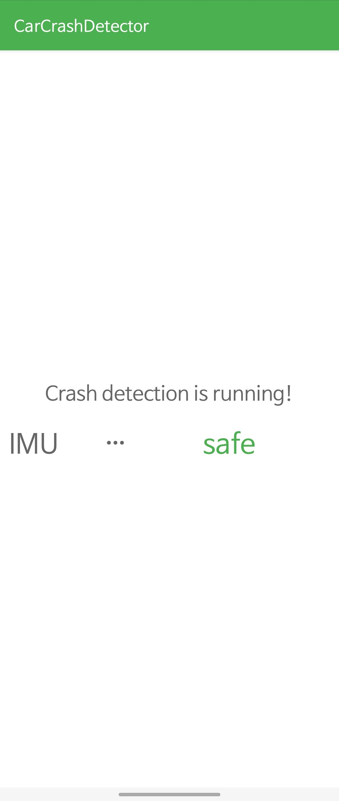
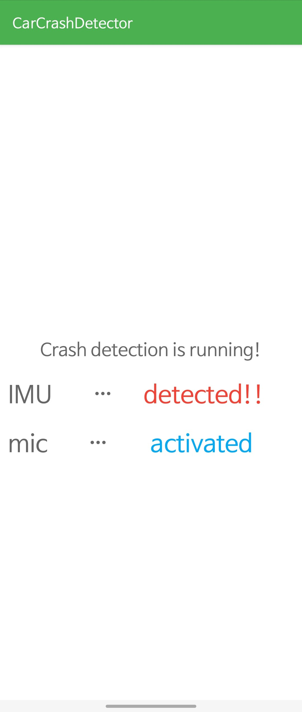

# Car Crash Detector
#### Team 50: 20190324 Wonho Song and 20190511 Jinseo Vik Lee

This repository contains the source code for CS330 Project4, an Android application that utilizes *IMU sensors* and a *microphone* to automatically detect car crashes. The application incorporates **two** separate deep learning models.

    
    

The repository consists of two directories:
1. `application`: This directory contains the source code for the Android application itself.
2. `machine learning`: This directory includes a *Google Colab* notebook file used to generate the deep learning models.

In order to provide a comprehensive understanding of the operational flow within each file, we have included a sufficient number of comments throughout the code. We encourage you to review the code for a detailed, code-level explanation of the application.

**Before proceeding to build and run the application, please ensure that you properly replace `tel:EMERGENCY_NUMBER_HERE` with the appropriate emergency phone number. This can be found in `MainActivity.java` at line 116.**